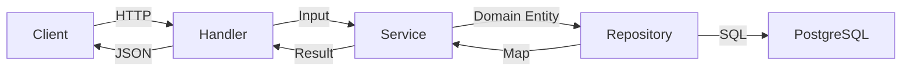
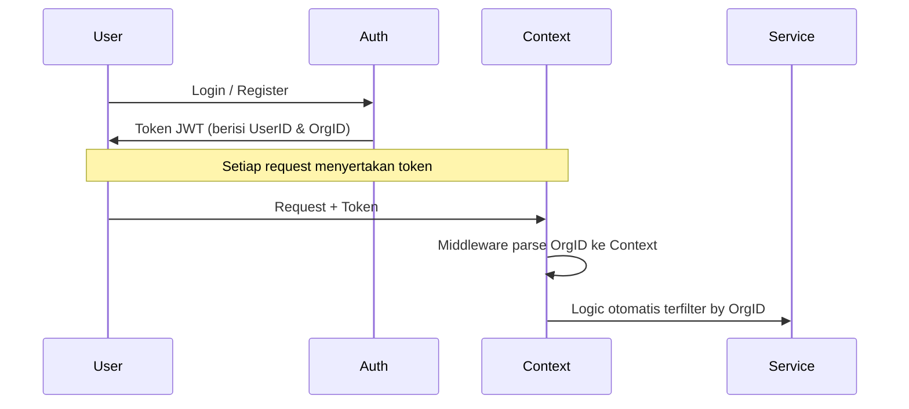
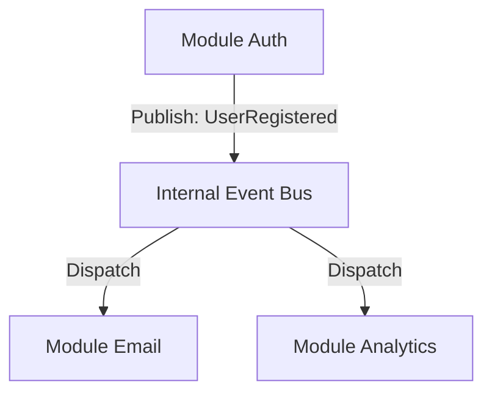

# Gokit Starter

Gokit Starter adalah boilerplate modern untuk membangun API menggunakan Go. Proyek ini dirancang dengan prinsip **Clean Architecture** dan **Modular Monolith**, fokus pada pemisahan kepentingan, testability, dan skalabilitas.

## 🚀 Tech Stack

- **Framework**: [Go-Chi](https://github.com/go-chi/chi) (Router)
- **Dependency Injection**: [Uber Fx](https://github.com/uber-go/fx)
- **ORM**: [Ent](https://entgo.io/) (Entity Framework for Go)
- **Caching**: [Redis](https://redis.io/) (via [go-redis](https://github.com/redis/go-redis))
- **Communication**: Internal In-Memory Event Bus
- **Validation**: [Go-Playground Validator](https://github.com/go-playground/validator)
- **Logging**: [Slog](https://pkg.go.dev/log/slog) (Standard Library)
- **Testing**: [Testify](https://github.com/stretchr/testify) & [Mockery](https://github.com/vektra/mockery) (Automated Mocks)
- **Documentation**: [Swagger/OpenAPI](https://github.com/swaggo/swag)
- **Otomasi**: [Taskfile](https://taskfile.dev/), [Lefthook](https://github.com/evilmartians/lefthook), & [Atlas](https://atlasgo.io/)

## 📁 Struktur Folder

Struktur ini memisahkan antara infrastruktur, transport layer, dan business logic secara tegas:

```text
├── cmd/                # Entry points aplikasi
├── database/           # Aset database (SQL Migrations)
│   └── migrations/     # File migrasi ter-versi (Atlas)
├── docs/               # Dokumentasi arsitektur & Swagger UI
├── internal/
│   ├── app/            # Bootstrapping (Fx Modules, Router setup)
│   ├── config/         # Konfigurasi runtime (Viper + Validation)
│   ├── database/       # Implementasi ORM (Ent, Schema)
│   ├── delivery/       # Transport layer (HTTP Middleware, Response)
│   ├── infra/          # Infrastructure (butuh config/external system)
│   │   ├── auth/       # JWT, bcrypt, context helpers
│   │   ├── cache/      # Redis wrapper + NullCache
│   │   └── database/   # Ent client wrapper
│   ├── modules/        # Domain business logic (Modular Monolith)
│   │   └── auth/       # Contoh module: Auth
│   │       ├── app/    # Service / Use Cases
│   │       ├── domain/ # Kontrak, Entitas, & Error Domain
│   │       ├── handler/# HTTP Handler (self-contained dalam modul)
│   │       └── infra/  # Implementasi Repository
│   └── pkg/            # Utilities (pure logic, tanpa external dep)
│       ├── apperr/     # Standardized error types
│       ├── eventbus/   # In-memory event bus
│       ├── logger/     # slog wrapper
│       ├── pagination/ # Pagination helpers
│       └── validate/   # Validator wrapper
├── scripts/            # Script pembantu (Module Generator)
├── test/
│   └── mocks/          # Mock yang dihasilkan secara otomatis (Mockery)
└── taskfile.yml        # Task runner (pengganti Makefile)
```

## 🧠 How It Works

### 1. Alur Request (Layer Interaction)

Aplikasi menggunakan pola pemisahan layer yang memastikan logika bisnis tidak tercampur dengan urusan teknis (DB/HTTP).



### 2. Stateless Multi-Tenancy (Hybrid Account)

Sistem mendukung akun **Personal** dan **Organization** secara stateless menggunakan JWT.



### 3. Komunikasi Antar Module (Event Bus)

Untuk menjaga modularitas, antar module berkomunikasi secara asinkron lewat Event Bus.



## 🛠️ Persiapan Pengembangan

Pastikan Anda sudah menginstal:

- Go 1.21+
- [Task](https://taskfile.dev/installation/) (`brew install go-task`)
- [Atlas CLI](https://atlasgo.io/getting-started/#installation) (`brew install ariga/tap/atlas`)
- Docker (untuk database PostgreSQL dan Redis)

### Langkah Awal

1. Clone repository:
   ```bash
   git clone git@github.com:masmuss/gokit-starter.git
   ```
2. Salin environment variables:
   ```bash
   cp .env.example .env
   ```
3. Jalankan infrastruktur:
   ```bash
   docker compose up -d
   ```
4. Jalankan aplikasi dengan hot-reload:
   ```bash
   task server
   ```

## ⌨️ Perintah Task (Taskfile)

Gunakan `task` untuk menjalankan perintah umum:

- `task server`: Menjalankan server dengan `air` (hot-reload).
- `task test`: Menjalankan semua unit test.
- `task mocks`: Menghasilkan mock otomatis menggunakan Mockery.
- `task generate`: Menghasilkan kode Ent dari skema.
- `task new:module name=...`: Melakukan scaffolding folder dan boilerplate untuk modul baru.
- `task viz`: Menghasilkan diagram visualisasi dependency graph Uber Fx.
- `task db:diff name=...`: Mendeteksi perubahan skema dan men-generate file SQL migrasi baru.
- `task db:migrate`: Menjalankan migrasi SQL ke database.
- `task db:clean`: Reset database development (Docker) ke kondisi bersih.

## 🗄️ Manajemen Database

Proyek ini menggunakan **Versioned Migrations** melalui **Atlas**. Jangan melakukan perubahan database secara manual.

### Alur Perubahan Skema:

1. Modifikasi skema di `internal/database/schema/`.
2. Jalankan `task generate` untuk memperbarui kode Go.
3. Jalankan `task db:diff name=deskripsi_perubahan` untuk membuat file migrasi `.sql`.
4. Review file SQL di folder `database/migrations/`.
5. Jalankan `task db:migrate` untuk menerapkan perubahan.

## 🏗️ Membuat Module Baru

Gunakan perintah generator untuk menjaga konsistensi arsitektur:

```bash
task new:module name=product
```

Sistem akan otomatis membuatkan folder `domain`, `app`, dan `infra` di bawah `internal/modules/product/`.

---

_Gokit Starter - Built for developers who love clean and maintainable code._
